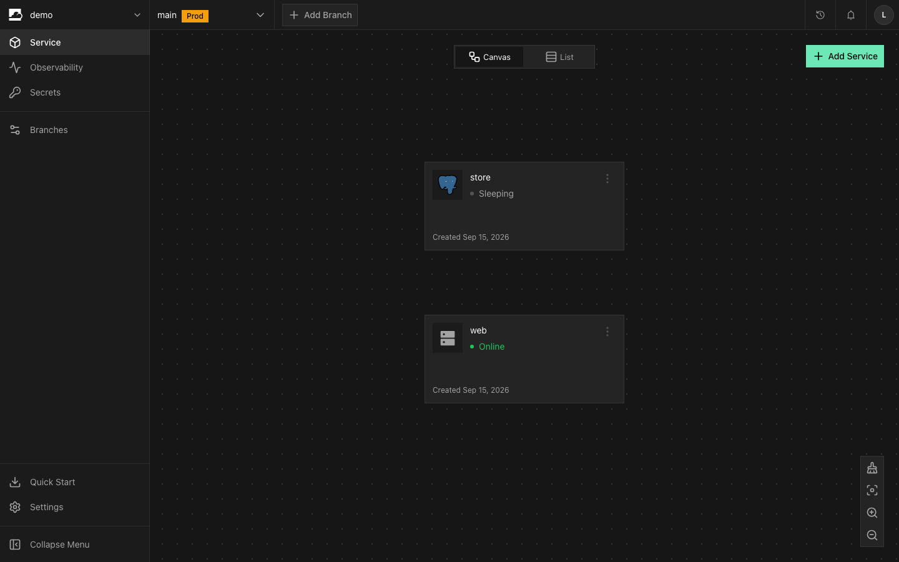
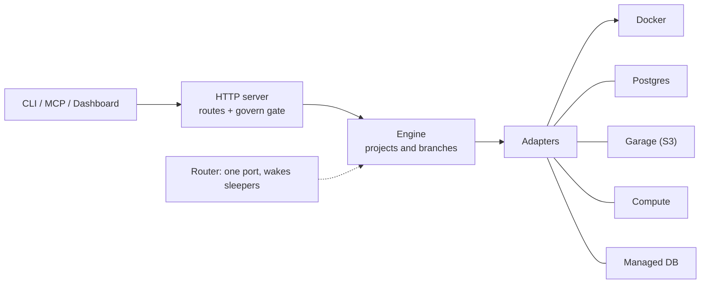

<p align="center">
  <picture>
    <source media="(prefers-color-scheme: dark)" srcset="docs/logo/dark.svg">
    
  </picture>
</p>

<h1 align="center">InstaCloud OSS</h1>

<p align="center">
  <b>The open-source, self-hostable PaaS: your own serverless cloud on a single box.</b>
</p>

<p align="center">
  A self-hosted alternative to Railway, Render, Fly and AWS. One daemon over your Docker gives every
  app a managed Postgres and S3 bucket, git push-to-deploy, disposable branch environments that fork
  all three, and scale-to-zero, with the same <code>insta</code> CLI, MCP server and agent skills as
  the hosted platform.
</p>

<p align="center">
  <a href="LICENSE"></a>
  <a href="https://github.com/InsForge/instacloud-oss/releases"></a>
  <a href="https://github.com/InsForge/instacloud-oss/actions/workflows/ci.yml"></a>
  <a href="https://discord.com/invite/MPxwj5xVvW"></a>
</p>

<p align="center">
  <a href="#quick-start">Quick start</a> &middot;
  <a href="#features">Features</a> &middot;
  <a href="#how-it-works">How it works</a> &middot;
  <a href="#deploy-from-github">Deploy from GitHub</a> &middot;
  <a href="https://github.com/InsForge/instacloud-cli">insta CLI</a> &middot;
  <a href="https://instacloud.com">Hosted InstaCloud</a> &middot;
  <a href="https://discord.com/invite/MPxwj5xVvW">Discord</a>
</p>

<p align="center">
  
</p>

```
project = a Postgres database + an S3 bucket + your app containers
branch  = a disposable, fully isolated clone of all three
```

## Quick start

On a fresh Ubuntu or Debian VPS (2 vCPU, 2 GiB RAM, 15 GiB free disk, with inbound 80 and 443
open), one command brings up the whole platform, TLS included:

```bash
curl -fsSL https://raw.githubusercontent.com/InsForge/instacloud-oss/main/install.sh | sudo sh
```

About a minute later you have a live URL and an admin setup page that mints your first CLI token.
Prefer to read the script first? Download it with `-o install.sh` and page through it before running,
rather than piping straight to `sudo sh`. No lock-in: it is plain Docker underneath, so your
containers keep running even if you stop using InstaCloud.

```bash
npm install -g insta                                    # then, from your machine
insta login --api-key insta_… --api-url https://api.<domain>
insta project create demo
insta services add postgres db
insta deploy --image nginx:alpine --port 80 --group web
# deployed nginx:alpine -> https://web-demo-main.<domain> (branch main, group web)
```

Full VPS walkthrough is in [Install on a VPS](#install-on-a-vps); to run it on your laptop with no
cloud account, see [Run on your laptop](#run-on-your-laptop).

## Features

- **Branches fork the disk.** `insta branch create` reflink-copies the Postgres data directory, every volume and the bucket, then redeploys the apps on their own URLs. A sleeping database on a reflink-capable filesystem forks in about a second whether it holds 100 MB or 100 GB; an awake or non-reflink source is streamed with `pg_basebackup` and scales with its size. The source is never touched.
- **Scale-to-zero.** Idle services stop and free your RAM; the next request wakes them in about two seconds. On the default branch apps and managed databases stay always-on by default while Postgres and branch clones scale to zero, so one box holds dozens of branches. Flip any service with `insta compute always-on off`.
- **A project is Postgres + S3 + your containers.** The daemon provisions all three and wires their credentials into your environment.
- **Git push-to-deploy.** Bind a compute service to a GitHub repo; each push builds the commit with BuildKit through an HMAC-verified webhook and redeploys it SHA-pinned ([how](#deploy-from-github)).
- **Agent-first.** Per-branch sandboxes, allow/deny/approve gates on sensitive actions, and a full audit trail (`insta agent events`): agents propose, you keep the veto.
- **Same API as the cloud.** The `insta` CLI, MCP server, agent skills and dashboard work the same self-hosted; cloud-only actions (billing, scaling, domain purchase) answer `501` with guidance.
- **One-command templates.** `insta template deploy <code>` from the bundled catalog, served off the box with no internet access.

## How it works

One daemon over your Docker. A request flows from the CLI, MCP server or dashboard through the HTTP
server (routes plus the govern gate), into the engine, out to an adapter, and down to Docker. A
single router fronts every port and holds the connection while a sleeping service wakes.



<details>
<summary>The components</summary>

- **router** (`src/router/`): one process listening for everything. HTTP by `Host`; Postgres, Redis and MongoDB by the name in the TLS handshake; MySQL on a port per service.
- **scheduler** (`src/scheduler.ts`): the sleep and wake state machine, the idle sweep, the memory-pressure pass, and one operation lock per service.
- **engine** (`src/engine.ts`): project and branch lifecycle, from provision through the fork to teardown with compensation on failure.
- **govern** (`src/govern.ts`): the policy engine, with allow/deny/approve per project, one-shot grants, and an HTTP 202 approval flow.
- **adapters** (`src/adapters/`): swappable providers behind small contracts, `LocalPostgres`, `LocalGarage`, `DockerCompute` and `LocalManagedDb` (private Redis, MySQL and MongoDB per branch).
- **data dir** (`src/datadir.ts`): where every byte lives, `pg/`, `vol/`, `md/`, `garage/`, keyed by immutable ids.
- **state** (`src/state.ts`): a single JSON file with a process lock beside it.

</details>

Command-by-command CLI and MCP compatibility: [COMPATIBILITY.md](COMPATIBILITY.md).

## Install on a VPS

The [Quick start](#quick-start) one-liner is the whole install. The details:

<details>
<summary>Requirements, installer output, upgrades and your own domain</summary>

A fresh Ubuntu 22.04+ or Debian 12+ box with 2 vCPU, 2 GiB RAM and 15 GiB free disk, and inbound
TCP 80 and 443 allowed in its cloud firewall or security group (add 5432 to reach Postgres from
outside). On the box, as a user with sudo:

```bash
curl -fsSL https://raw.githubusercontent.com/InsForge/instacloud-oss/main/install.sh | sudo sh
```

The installer checks the box first (free ports, memory, disk) and stops before changing anything if
one falls short. Then it installs Docker if it is missing, prepares a reflink-capable data
directory, pulls `ghcr.io/insforge/instacloud` (linux/amd64 and linux/arm64), starts the daemon,
the TLS edge and the object store, and waits for a certificate. On a 2 vCPU, 2 GiB cloud VM that
takes about a minute and ends like this:

```
InstaCloud is running.
  Setup:    https://console.203-0-113-10.sslip.io/setup
  API:      https://api.203-0-113-10.sslip.io
  Note:     203.0.113.10 is this cloud VM's public address, mapped by the provider: make sure its security group or firewall allows 80 and 443 (and the database lanes you use).
  CLI:      insta login --api-key <token from the setup page> --api-url https://api.203-0-113-10.sslip.io
  Config /etc/instacloud   Data /var/lib/instacloud   Reflinks: loop image (10 GiB)
```

If a `Note:` line appears, act on it before you go on: the certificate and your URLs need 80 and
443 open. `curl -s https://api.<domain>/healthz` answers `{"ok":true}` once the daemon is up.

Then, from your own machine:

1. Open the Setup URL, create the admin account, and create a CLI token on the next screen.
2. Install the CLI (Node 18+) and log in with that token:

   ```bash
   npm install -g insta
   insta login --api-key insta_… --api-url https://api.203-0-113-10.sslip.io
   ```

3. Deploy something:

   ```bash
   mkdir my-app && cd my-app          # the CLI links the project to this directory
   insta project create demo
   insta services add postgres db
   insta deploy --image nginx:alpine --port 80 --group web
   # deployed nginx:alpine -> https://web-demo-main.203-0-113-10.sslip.io (branch main, group web)
   ```

   Or start from a template: `insta template deploy hermes` asks for the dashboard's username and
   password.

The installer installs the newest release. Re-run the same command to upgrade, or pin a release
with `curl -fsSL https://raw.githubusercontent.com/InsForge/instacloud-oss/main/install.sh | sudo sh -s -- --version v0.2.0`.

With no `--domain` the installer uses the public IP of the box as an sslip.io name, so URLs work
immediately. Apps land on `https://<group>-<project>-<branch>.<domain>` and databases on
`pg-<name>-<project>-<branch>.<domain>:5432`.

Full details, including firewalls, reflinks and your own domain:
[docs.instacloud.com/self-hosting](https://docs.instacloud.com/self-hosting/overview).

</details>

## Deploy from GitHub

Server-mode boxes auto-deploy on `git push`: bind a compute service to a repo, add the webhook the
daemon returns, and each push to the tracked branch builds the pushed commit with BuildKit and
redeploys it, pinned to the commit SHA. The repo needs a `Dockerfile` at its root; a private repo
needs a GitHub Personal Access Token with `contents: read` scope (fine-grained) or `repo` (classic).
Self-hosted only: the cloud's GitHub-App connect needs a multi-tenant app, so it stays `501`.

<details>
<summary>API walkthrough</summary>

The daemon builds the pushed commit itself with BuildKit (no remote build gateway), so a custom
Dockerfile path and build args are not exposed yet. Wired via the API today:

```bash
# read the tokens interactively so they never land in shell history; they are then fed to curl OFF
# its command line below (auth header via a process-substitution fd, body via stdin), so neither
# reaches argv / a process listing either. (Get the API token from the console: Account > API Tokens.)
read -rs -p 'InstaCloud API token: ' INSTA_API_TOKEN; echo; export INSTA_API_TOKEN
read -rs -p 'GitHub PAT (blank for a public repo): ' GITHUB_PAT; echo; export GITHUB_PAT

# 1. deploy the service once to create the compute group. Set --port to the port your repo's app
#    listens on: push-to-deploy reuses whatever port the group is currently configured with (a later
#    `insta deploy` on the group with no --port resets it to 8080). The image is a throwaway
#    placeholder; the first build from your repo replaces it.
insta deploy --image nginx:alpine --port 3000 --group web   # 3000 is an example; use your app's port

# 2. bind it to a repo. The response carries a webhook URL and its SECRET (needed in step 3).
#    The auth header is read from a process-substitution file and the body (with the PAT) from
#    stdin, so neither secret is passed as a command-line argument.
curl -sX POST https://api.<domain>/projects/<project-id>/services/cp-web/git \
  -H @<(printf 'authorization: Bearer %s' "$INSTA_API_TOKEN") \
  -H 'content-type: application/json' --data @- <<JSON
{"repo":"owner/repo","ref":"main","token":"$GITHUB_PAT"}
JSON

# 3. add that webhook to the repo: Settings > Webhooks > Add webhook:
#    Payload URL = the returned webhook URL, Content type = application/json,
#    Secret = the returned webhook secret (REQUIRED: without it GitHub sends no signature and the
#    daemon rejects the push 401). Then just push:
git push        # the daemon checks out the pushed commit, builds it, and redeploys the service
```

The webhook is HMAC-verified over the raw body, the build is pinned to the pushed commit SHA, and the
redeploy reuses the service's port. Push-to-deploy honours the project's `deploy` governance policy:
it auto-deploys only when that policy is `allow`. `GET`/`DELETE` on the same path show or remove the
binding. See [COMPATIBILITY.md](COMPATIBILITY.md) for the full behaviour.

</details>

## Run on your laptop

No cloud account, no API keys, no auth: the daemon trusts loopback. Needs Docker (running) and Node
22 or newer.

<details>
<summary>Clone, run, and point the CLI at it</summary>

```bash
git clone https://github.com/InsForge/instacloud-oss.git && cd instacloud-oss
npm install
npm run build:ui        # optional: the dashboard, served by the daemon itself
npm run dev             # the daemon on http://127.0.0.1:8080  (INSTA_OSS_PORT to change)
```

First run pulls `postgres:16-alpine`, `dxflrs/garage` and `rclone/rclone`; give it a minute. State
lives in `~/.insta-oss/`.

In another terminal, install the CLI and point it at the daemon:

```bash
npm install -g insta
export INSTA_API_URL=http://127.0.0.1:8080      # the CLI defaults to the cloud
```

No `insta login`: the daemon trusts loopback. Skip `insta agent setup`, which registers the cloud's
MCP server; the dashboard's Quick Start page prints this box's own setup steps. App URLs are
`http://<group>-<project>-<branch>.localhost:8080`.

</details>

## What it looks like

<details>
<summary>A full session, command by command</summary>

A session against a server-mode box on `example.com`. On a laptop the same commands print
`http://web-demo-main.localhost:8080` for the app and a `127.0.0.1:<port>` DSN, because local mode
has no domain and no TLS.

```bash
$ cd ~/my-app                       # the CLI links the project to your cwd
$ insta project create demo
created project 4496c3e1-… (demo)
  resources:
  linked ./.insta/project.json (branch main)

$ insta services add postgres db
$ insta services add storage store
$ insta secrets --print             # the branch's credentials (gated: secrets.read)
DATABASE_URL="postgres://postgres:…@pg-db-demo-main.example.com:5432/app?sslmode=require"
AWS_ACCESS_KEY_ID="GK…"  AWS_SECRET_ACCESS_KEY="…"  AWS_ENDPOINT_URL_S3="https://s3.example.com"
BUCKET_NAME="io-demo-main-store"

$ insta deploy --image nginx:alpine --port 80 --group web
deployed nginx:alpine -> https://web-demo-main.example.com (branch main, group web)

$ insta branch create feat          # forks the db files and the volumes
created branch feat (…)             # a sleeping database forks in about a second

$ insta compute always-on off web   # main is always-on by default; opt this one into scale-to-zero
$ insta compute status web          # five idle minutes, and at least ten after creating it
web  desired=running  live=suspended

$ curl -s https://web-demo-main.example.com/ | head -1   # a request wakes it in ~2s
<!DOCTYPE html>

$ insta branch delete feat          # done with the task: throw the clone away
```

`insta agent manifest` shows each branch's db, storage and compute with their URLs.

</details>

## Dashboard

The daemon serves the web UI at its own URL, one process, same origin. Server mode starts at
`/setup` (one admin account), signs in at `/login`, and mints API tokens under Account > API Tokens;
a laptop has no login at all. It mirrors the hosted InstaCloud console.

<details>
<summary>What's in it</summary>

A Service canvas (or list) with status and a Wake button, plus Observability, Secrets, Branches,
Quick Start and Settings, an Activities side panel for notifications, and each service's detail as an
overlay (Metrics, Variables, Runtime Logs, Settings). Postgres adds a Database tab that offers Wake
and browse while the database sleeps, rather than waking it on sight; apps add a Volume tab; every
database has Connect, with its connection string, a client command and the `insta` line. Add Service
covers a Docker image, an empty service, Postgres, Redis, MySQL, MongoDB, object storage and View
Templates. Variables lists the names a service receives, never the values: read those with
`insta secrets --print`, or a database's through Connect. An empty project shows the connect-agent
panel with this box's CLI setup. Gated actions from the UI use the same 202-and-approve flow as the
CLI.

Locally: `npm run build:ui` once, then open http://127.0.0.1:8080. UI development:
`cd ui && npm run dev` (Vite on :5173, proxying API calls to the daemon).

</details>

## Using it with agents

`insta project create` (or `link`) installs the insta agent skills into your project (gitignored;
`.claude/skills/` for Claude Code, `.agents/skills/` for Codex), so a coding agent opened in the repo
already knows the workflow: one task, one branch, deploy, verify, delete. You keep the veto through
allow/deny/approve gates (Settings > Agent Governance, or `PUT /projects/:id/policy/:action`): a gated
action parks until you run `insta agent approvals approve`, and every action lands in the
`insta agent events` audit trail. The insta-mcp server is a thin client over the same endpoints:
point it at the daemon with `PLATFORM_API_URL=https://api.<domain>` and an `insta_` token.

## Templates

Each folder in [`templates/`](templates/) is an app deployable in one command
(`insta template deploy <code>`), served off the box through the same `/templates` routes the hosted
platform uses, with no internet access. Add one with a single pull request
([layout](templates/README.md), [CI rules](templates/AGENTS.md)); the published ones show up in the
[gallery](https://instacloud.com/templates). The [Deploy on InstaCloud](assets/README.md) button
those READMEs carry is free for any repository to use.

## Compatibility

[COMPATIBILITY.md](COMPATIBILITY.md) is the command-by-command table: what works, what differs by
run mode, and what answers 501 with guidance instead of pretending.

## Tests

<details>
<summary>Running the suite</summary>

`npm test` needs no Docker. It does use the `openssl` CLI for the TLS cases (Node can parse an
X.509 certificate but not issue one, and these cases mint pairs with particular SANs and
validity windows); where openssl is absent those cases are skipped by name and the rest of the
suite runs.

```bash
npm test                                       # contract tests, fake adapters, no Docker
RUN_DOCKER_TESTS=1 npx vitest run test/clone-isolation.int.test.ts   # one Docker file at a time
sh e2e/local-smoke.sh                          # the whole public surface, real CLI, real Docker
```

The isolation tests prove clone independence for real: writes to a branch's database and bucket
never reach the source. [e2e/README.md](e2e/README.md) covers the end-to-end scripts and what they
deliberately do not cover.

</details>

## Cleanup

<details>
<summary>Removing containers, data and the stack</summary>

On a laptop:

```bash
insta project delete                                        # per project (approval is opt-in: set project.delete to approve in the dashboard)
docker ps -aq --filter name=io- | xargs docker rm -f        # every InstaCloud OSS container
docker volume rm io-garage-meta io-garage-data              # the shared object store data
rm -rf ~/.insta-oss                                         # daemon state
```

On a server, stop the stack instead and keep the data:

```bash
cd /etc/instacloud && docker compose down
```

Removing the install completely, data and mounts included, is
[Uninstall](docs/self-hosting/install.mdx#uninstall).

To remove only the project containers there, filter by project so the stack itself survives:

```bash
docker ps -aq --filter name=io-<project>- | xargs docker rm -f
```

</details>

## Security

Please do not open a public issue for a security vulnerability. Report it privately by email to
[info@insforge.dev](mailto:info@insforge.dev) and we will respond as quickly as we can.
[SECURITY.md](SECURITY.md) has the details and what to include.

## Contributing

See [CONTRIBUTING.md](CONTRIBUTING.md) for the code map and the rules every change follows. Two
good entry points: a provider adapter (implement one interface from `src/types.ts` as a new file in
`src/adapters/`, wire it in `src/main.ts`, and nothing else changes), or a
[template](templates/README.md), which needs no knowledge of the daemon at all.

## Community

- [Discord](https://discord.com/invite/MPxwj5xVvW): questions and support
- [X / Twitter](https://x.com/InsForge): release updates
- [info@insforge.dev](mailto:info@insforge.dev)

## License

Apache-2.0. See [LICENSE](LICENSE).
