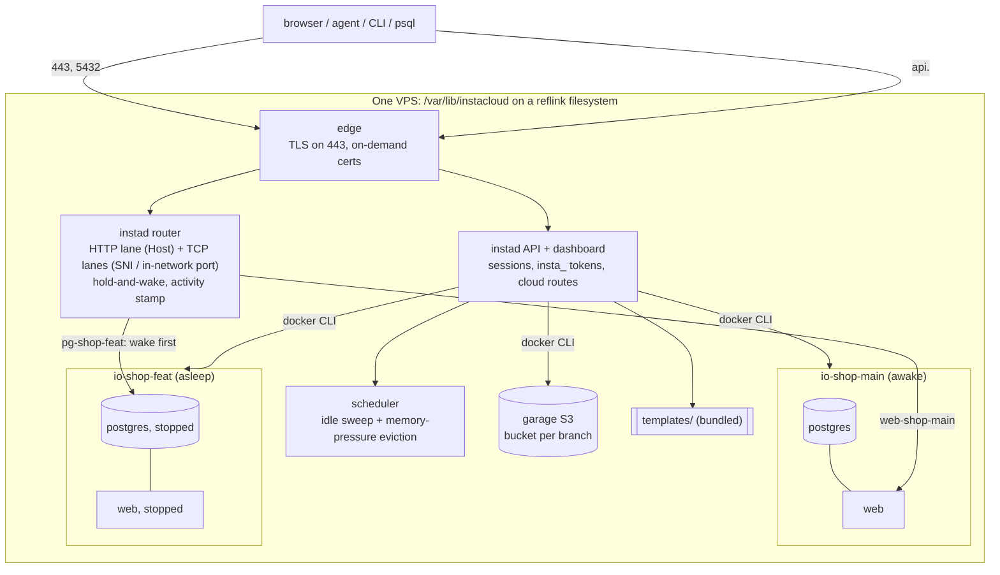
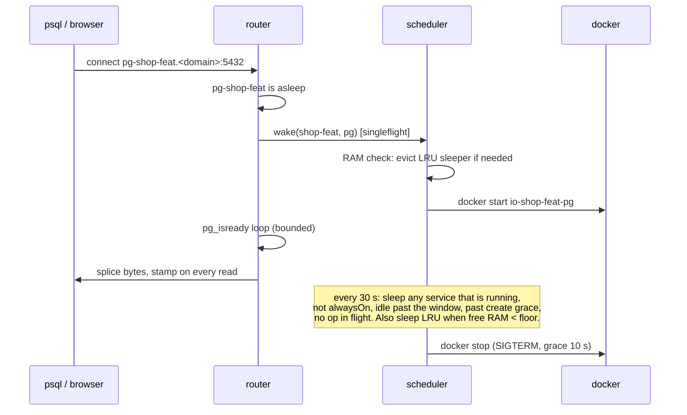
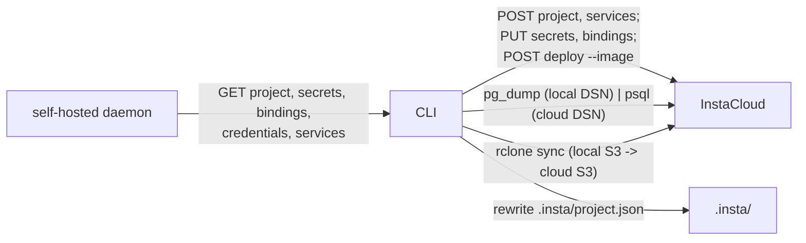

# InstaCloud Open Source: single-node serverless, same experience as the cloud

> One page, one target state. Sign-off from Tony. Companion to the "Open Source InstaCloud" decision doc. Written against insta-oss origin/main 72d8982, insta-cli 0.0.60, insta-platform e17d86d (2026-09-08). Every "today" claim names the file that implements it. Supersedes the 2026-09-08 v1 draft.

## TL;DR

The runtime stays what it is, a single daemon over Docker that serves the cloud's API, and gains four things it lacks today: an identity (setup page, sessions, `insta_` tokens), a **router** (hostnames, TLS, and hold-and-wake on both HTTP and database connections), a **serverless scheduler** (idle sweep plus memory-pressure eviction, so one box holds dozens of branches with only the active ones awake), and **file-level branch forks** on a reflink filesystem the installer guarantees. Templates come from the repo's own `templates/` directory through the cloud's routes. A one-line install brings all of it up on a fresh VPS with a working URL before the operator owns a domain.

Rules of the road: the daemon adds **no endpoint the cloud does not have**. The only CLI change is `insta migrate`, which drives both backends through contract routes. Platform, console, MCP, skills code: untouched.

## Intro

Tony's decision doc makes insta-oss the front door for InstaCloud open source and asks for eight things: a dashboard that manages containers (done), serverless on one machine, fast branching, real per-branch URLs, a one-line VPS install, governance, templates and docs in the repo (done), and a one-command migration to the cloud. It also asks that the self-host experience match the cloud's and that we learn from the best one-machine PaaS projects.

Three facts shape the plan.

1. **The daemon trusts localhost as its whole security model.** It binds 127.0.0.1 and checks no bearer (`src/main.ts:21`, `src/server.ts`). A VPS needs an identity.
2. **The cloud already defines sleep and wake precisely** (`insta-compute/docs/sleep-and-wake.md`): one activity stamp per service, a sweep with grace, four wake doors. Copying that definition is what "same experience" means for serverless.
3. **The contract is the cloud's, full stop.** CONTRIBUTING says "New endpoint: don't. The surface mirrors the standard `insta` CLI." Every capability below is either a cloud route the daemon answers 501 to today, or daemon-internal behaviour with no API surface.

## Goals and non-goals

**Goals**

- **Same experience as the cloud.** A user or agent who knows InstaCloud knows the self-hosted one: same CLI, skill, MCP, routes, URL shape per service, credential seam, sleep semantics, templates, dashboard IA.
- **Truly serverless on one node.** Compute, Postgres and managed databases all sleep when idle and wake on their first connection. Under memory pressure the least-recently-active services sleep first. Idle costs RAM only for what is awake.
- **Branch in seconds regardless of size.** Postgres data and compute volumes fork at the file level.
- **One-line install** that ends with a setup URL, TLS, and a usable auto domain.
- **Templates and deploys** from the dashboard and the CLI: image, template, and source (with the CLI on the box).
- **`insta migrate`** to the cloud through contract routes only.
- **Public e2e** in the repo proving parity on every shared operation.

**Non-goals**

- Multi-node, HA, replicas, Swarm. One VPS.
- Billing, orgs, members, invitations: clean 501s, as today.
- Private registries in v1.
- Point-in-time recovery. Scheduled backups are a later milestone in this doc, not v1.
- Cloud to self-host migration.
- Any endpoint the cloud lacks (superseded 2026-09-21 for one sanctioned exception: the self-hosted-only git push-to-deploy build endpoint, see the builder note below). Any change to platform, console or MCP.
- Governance product decisions. The code stays as is (FAQ).
- Open-sourcing insta-compute or insta-db.

## What "match the cloud" means, concretely

The skill documents today's divergences (`insta-skills/insta/references/operate.md:239-258`). Each one either closes or is declared a permanent 501.

| Experience | Cloud | insta-oss today | Target |
|---|---|---|---|
| Login | device / OAuth / api-key / email | none, localhost trust | setup page creates the admin; `insta login --api-key` with a token minted at `/tokens` |
| Service URL | `https://<route_key>.compute.<base>` | `http://localhost:<hostPort>` (`src/adapters/compute.ts:32`) | `https://<service>-<project>-<branch>.<domain>` |
| Database URL | proxy hostname, reachable from anywhere, wakes on connect | container-network host, unreachable from the host, never sleeps | `postgres://…@pg-<project>-<branch>.<domain>:5432`, wakes on connect; `insta db connect` works |
| Managed redis/mysql/mongo | lane hostname, wakes on connect | container-network host, never sleeps | same lane model, wake on connect |
| Sleep | stamp + sweep + 4 wake doors | `docker pause` on explicit request only (`compute.ts:59`) | same rules; stop, not pause; plus pressure eviction |
| `always-on` | `PUT …/always-on` | 501 (`src/server.ts:505`) | implemented |
| `limits` (cpu, memory) | `GET/PUT …/limits` | 501 (`server.ts:503-504`) | implemented as `--cpus` / `--memory` |
| `scale` (replicas) | implemented | 501 | stays 501 (single node) |
| Templates | catalog + `template-deployments` | daemon has no template code | served from bundled `templates/` |
| Source deploy | remote build via deploy token | CLI builds locally, local tag (`deploy.ts:121-130`) | unchanged: works when the CLI runs on the box; from a laptop use image or template |
| Custom domain | `compute/domain` routes | 501 (`server.ts:509-511`) | implemented via the edge |
| Branch create | copies DB, forks bucket, clones compute | dump/restore DB, rclone bucket, redeploys parent image, empty volume | file-level fork of DB and volumes, rclone bucket |
| Project create | starts empty; `services add` up to 5 per type | auto-provisions one postgres + one storage; extra 501 | match cloud: start empty, multiple per type |
| Backups | `backups` routes | 501 | later milestone (M7) |
| Metrics, logs | windowed, cursor | snapshot, tail | keep as is in v1; windowed in M6 |
| Usage, billing, orgs, tokens for others | implemented | 501 | 501 stays, except `/tokens` for the admin |

## What we take from the one-machine PaaS pattern

Tony asked to learn from the best-known single-node PaaS. Stated in our own terms, these are the rules the design follows (the survey itself is Appendix C):

1. **One root script installs everything**, including Docker, refuses if 80 or 443 are busy, keeps all state in one directory, and re-running it is the upgrade.
2. **The control plane runs as containers holding the Docker socket.** There is no daemon to build on the host.
3. **First visit is the setup page.** The operator creates the admin there, not in a config file.
4. **Every service gets a URL and a certificate on first request**, on an IP-embedded auto domain until the operator owns one. Per-host certificates only; self-signed fallback when issuance fails.
5. **Templates carry generated secrets and resolve their own URLs**, so a one-click deploy is complete.
6. **Backups go to S3-compatible targets on a schedule.**
7. **API keys with scopes, and the API documented.** Ours is the cloud's OpenAPI.

And the two things none of them do, which are the reason this runtime exists: **sleep** and **branch**.

## Proposed design

### The target machine

What is new: edge, router, scheduler, identity, bundled templates, the data directory. Everything inside a branch network is today's engine and adapters (`src/engine.ts`, `src/adapters/*`).

### 1. Install and first run

`curl -fsSL https://get.instacloud.com | sh` (CloudFront, same as agents.instacloud.com).

1. Require root and Linux. Refuse if 80, 443 or 5432 are busy. Install Docker if missing.
2. Create `/var/lib/instacloud`. Probe reflinks with `cp --reflink=always`. On a filesystem without them (ext4, the Ubuntu default) create `data.img`, format it XFS with `reflink=1`, loop-mount it there, add an fstab entry.
3. Detect the public IP; default domain `<ip-with-dashes>.sslip.io`.
4. Write `compose.yml` (instad, edge, garage) and `instad.env`, `docker compose up -d`.
5. Print two lines: the setup URL `https://console.<domain>/setup`, and "re-run this script to upgrade".

Minimum 2 vCPU, 2 GiB, Ubuntu 22.04+, Debian 12+, amd64 and arm64. The image `ghcr.io/insforge/instacloud:<version>` contains Node, the daemon, the built dashboard, the Docker CLI and the templates directory. Localhost mode on a laptop (`npx`, no edge, no auth) stays exactly as today.

### 2. Identity

- **Setup page** on first visit: admin email and password, stored hashed in state. One admin in v1.
- **Dashboard session**: httpOnly cookie, same shape as the console's.
- **`/tokens`**: the cloud's `GET/POST/DELETE /tokens` routes, 501 today (`src/server.ts:58-60`), mint and revoke `insta_` keys for the admin. The setup page offers "create a CLI token" and shows the exact `insta login --api-key <k> --api-url https://api.<domain>` line. `insta login --api-key` already accepts `--api-url` (`insta-cli/src/commands/auth.ts:10-24`), so no CLI change.
- **Every route** except `/healthz`, the setup page and static files requires a session or a bearer. The MCP server forwards any bearer, so it works unchanged.
- Localhost mode keeps `/me` as `local` with no auth.

### 3. Router: one place for hostnames, TLS and wake

A Node proxy inside the daemon with three lanes, fronted by an off-the-shelf TLS edge for 443.

**Hostnames.** `<service>-<ref>.<domain>` where `ref` is the frozen `<project>-<branch>` slug the engine already mints (`src/engine.ts:45-48`): `web-shop-main.203-0-113-7.sslip.io`, `pg-shop-main.…`, `redis-cache-shop-main.…`. API at `api.<domain>`, dashboard at `console.<domain>`, public buckets at `<bucket>.s3.<domain>`. Manifest `ref.url`, `services[].domain`, `DATABASE_URL` and the managed bundles all carry these.

**HTTP lane (443 via the edge).** Route by `Host` to `(branch network, container, port)`. Dial the container by name on its network, the path apps already use (`src/engine.ts:238`). Nothing is published on the host, which also deletes the host-port allocator and its collision bug (`src/engine.ts:210-215, 278-289`).

**TCP lane, external (5432, 6379, 3306, 27017 on the host).** For Postgres: accept, answer the client's `SSLRequest`, terminate TLS with the edge's certificate, read SNI, route to the branch database. libpq sends SNI by default since Postgres 14, which is exactly how the cloud proxy routes (`<route_key>.<region>.pg.instadb.tech`). Redis and Mongo route on TLS SNI the same way, but the installer does not open their ports publicly, and where it finds no active ufw or firewalld it restricts nothing and warns instead (the lanes bind 0.0.0.0, so those two ports are then only as private as the box's own security group). An internet-facing Redis or MongoDB on every self-hosted box is a default this project will not ship; the tighter follow-up is a per-lane bind so redis and mongodb can sit on the docker bridge while Postgres stays public. MySQL speaks first and has no SNI, so external MySQL uses the in-network lane only, or a dedicated port per service allocated by the daemon.

**TCP lane, in-network.** The router container joins every branch network (as Garage does today, `src/adapters/garage.ts:151`) with a network alias per service hostname. Inside `io-shop-main`, `pg-shop-main.<domain>` resolves to the router, and the router identifies the target by `(network, port)`. Plaintext, no SNI needed, and the app's `DATABASE_URL` goes through the router so a sleeping database wakes when the app connects. This is the single-node analogue of the cloud's in-cluster lane.

**Hold-and-wake.** On any lane, a connection or request for a sleeping service triggers one wake (singleflight per service), is held until the service is ready (a port probe, `pg_isready` for Postgres), then proxied. Bounded at 60 s, then 503 or a connection reset.

**TLS edge.** An off-the-shelf HTTPS server with on-demand certificate issuance, configured with one `ask` URL on the daemon that answers whether a hostname is ours. Per-host certificates on the auto domain (the auto-domain provider does not support wildcards). Self-signed fallback. The router reuses the edge's certificate store for 5432.

**Custom domains.** `insta compute domain add shop.example.com` implements the cloud's `compute/domain` routes. The operator points a CNAME at the box; the edge issues on first request.

### 4. Serverless on one node

- **Activity stamp**, one per service. HTTP lane: at request start and every 5 s while a handler is in flight. TCP lanes: on every non-empty read in the splice, both directions. This is the cloud's rule (`sleep-and-wake.md` 1.2), including its limits: an open browser tab holds a service; a silent open connection does not.
- **Idle sweep** every 30 s: sleep when running, not `alwaysOn`, stamp older than the idle window, older than the create grace, no deploy or lifecycle op in flight. Default window **5 minutes** for compute, **10 minutes** for databases, both per-install settings. Tony's position of record is minutes, not 90 s.
- **Memory-pressure eviction**, the single-node addition. The scheduler knows every container's RSS (`docker stats`). When free RAM drops below a floor (default 15%), or a wake needs room, it sleeps the least-recently-active non-`alwaysOn` service first. This is what makes "one VPS holds dozens of branches" true rather than hopeful: the box holds N awake, and everything else costs disk only.
- **Sleep means `docker stop`** with a 10 s SIGTERM grace, not `docker pause`. Pause frees CPU and keeps RAM. Volumes and the write layer survive a stop. Optional first tier, pause after N minutes then stop after M, off by default.
- **Wake doors**: an inbound request or connection on any lane, `insta compute start`, a deploy. No timer, no outbound, no CPU wake. A service the user explicitly stopped is never woken by traffic. Same four doors as the cloud minus the reconciler, which has no meaning on one node.
- **Postgres sleeps cleanly**: `docker stop` sends SIGTERM, Postgres does a fast shutdown, wake is a normal start with `pg_isready` in 1 to 3 s. A pool that connects during the wake sees a slow connect, not an error. Redis with `appendonly`, MySQL and Mongo shut down cleanly on SIGTERM.
- **`alwaysOn`** from the template manifest or `PUT …/always-on`. Only hermes, n8n and openclaw declare it today. Honoured by both the sweep and eviction; eviction never touches them.
- **`limits`**: `PUT …/limits { cpu, memoryMb }` maps to `--cpus` / `--memory` on the container, and feeds the eviction budget.

### 5. Branching: fork the files, keep the containers

Today a branch clone is `pg_dump` into the daemon's memory then `psql` (`src/adapters/postgres.ts:28-31`), O(data), and the cause of the readiness flake in issue #34. The 2026-07 plan (one shared Postgres, `CREATE DATABASE … STRATEGY FILE_COPY` reflink clones) never shipped and would require quiescing the source and sharing one server's settings and failure domain.

Target: **container-per-branch, data directory forked.**

1. Postgres data lives at `/var/lib/instacloud/pg/<ref>` (bind mount) on the reflink filesystem the installer guarantees.
2. Clone: only from a source AT REST (stopped, which is what a sleeping database is), `cp --reflink=always -a` of the directory, start the new container on it. Postgres treats it as a crash-consistent restart. Sub-second at any size. Nothing is woken to be cloned. A RUNNING source takes the `pg_basebackup` path below instead: a file-by-file walk of a live data directory copies several different moments of it, which `CHECKPOINT` does not prevent, so it is not a valid backup (Postgres allows a file-level copy only against a stopped server, an atomic snapshot, or `pg_backup_start`/`pg_backup_stop` with full WAL retention).
3. Fallback without reflinks: `pg_basebackup` streaming over the branch network. Never a buffer in the daemon.
4. Compute volumes: `/var/lib/instacloud/vol/<ref>/<group>`, forked the same way. Today a branch gets an empty volume, which is wrong for agent templates whose whole state is on `/data`.
5. Buckets: `rclone sync` between Garage buckets stays in v1 (`src/adapters/garage.ts:140-146`).
6. Branch compute: keep today's behaviour (parent image redeployed, `src/engine.ts:135-141`), now with a forked volume, and put it to sleep immediately unless `alwaysOn`. A new branch costs disk, not RAM.

Same model as the cloud, where a branch is a disk clone, so one sentence works for both: a branch is a fork of the disk.

### 6. Templates

The daemon has no template code today (`grep template src/server.ts` is empty); `insta template list|deploy` resolve against the hosted catalog. The image bundles the repo's `templates/` and serves the cloud's routes: `GET /templates`, `GET /templates/:code`, `POST /projects/:id/template-deployments`, `GET /template-deployments/:id`. The CLI already calls exactly these (`insta-cli/src/commands/template.ts:310-416`), so no CLI change. The engine implements what a manifest needs: `image`, `port`, `healthcheck`, `alwaysOn`, `volume: true`, `env.fixed|generated|required|optional`, and `${services.<name>.url}` resolved to router hostnames. Dashboard gets a Templates gallery with the deploy form. "Deploy Hermes on your VPS in one command" is the demo.

### 7. Deploy lanes

- **Image**: `insta deploy --image` and the dashboard Deploy dialog. Works today.
- **Template**: section 6.
- **Source**: unchanged. The CLI builds locally when the daemon 501s `/deploy-token` and hands over a local tag. That works when the CLI runs on the box (ssh in, or an agent running there). From a laptop against a remote daemon it cannot, and the CLI says so. No daemon-side builder and no context-upload route in this spec: the cloud has no such contract, and adding one would be an oss-only endpoint. Revisit when the cloud's build contract is exposed. (Superseded 2026-09-21: the daemon now ships native git push-to-deploy, `docker build` from an HMAC-verified webhook, as the one sanctioned self-hosted-only endpoint. See the builder note below for the reasoning.)

### 8. Backups (M7, after v1)

Implement the cloud's `backups` routes: `pg_dump` per branch and a tar of each volume to an S3-compatible target on a schedule, `restore` as an in-place rollback to a named backup, matching the cloud's semantics. Listed because every one-machine PaaS has it and because a self-host without backups is not a production story.

### 9. Dashboard

Keep the Vite app on `@insforge/ui`. Add: setup and login pages, a tokens page, a Deploy dialog (image, template), a Templates gallery, Domains on the service page, sleep state and "wake" on the service row, limits and always-on toggles. Then close issue #18 against the console's IA: service detail shell with Buckets / Variables / Settings sub-navigation, Postgres detail with a Backups tab. Ported, not shared: the console's Next RSC plus cookie BFF cannot be served by the daemon.

### 10. `insta migrate`: contract routes only

- The CLI holds one backend and scrubs the session on a URL override (`insta-cli/src/config.ts:52-61`), so `migrate` is the one command that builds two clients: source from `INSTA_API_URL` plus its token, target from the stored cloud session.
- Reads from the source through contract routes: `GET /projects/:id`, `/secrets/tree`, `/secrets`, `/secret-bindings`, `/services/:sid/credentials`. Writes to the target through the same routes the CLI already uses.
- **Data moves run on the operator's machine** with `pg_dump | psql` and `rclone`, the way `insta db connect` already spawns `psql` (`insta-cli/src/commands/db.ts:323`). Precondition: the local DSN is reachable, which the router's TCP lane provides (today it is a container-network host).
- Images: a template or public ref passes through; the cloud pulls anonymous public images only (`insta-platform/src/provisioning/registry.ts:28-36`). A local-only tag needs `--registry`; otherwise the plan says so.
- Not carried in v1: volumes and managed-DB data (the cloud has no seed route except a 180 s `exec`, `server.ts:1961-2001`). The plan lists them as recreated empty.
- `--plan` prints everything first; `--resume` reuses a partial target; the local project is never touched; `.insta/project.json` is rewritten at the end.

### 11. Public e2e

`insta-oss/e2e/` holds the self-host leg of the private suite (the `is_oss()` branches of `cleanroom.sh`, `branch-e2e.sh`, `fixture-e2e.sh`) plus new steps: install on a fresh runner, setup page and token login, URL routing, sleep then wake for compute and Postgres, eviction under a RAM cap, template deploy, branch fork timing, migrate against staging. The private suite keeps cloud-only steps and runs the public one as a job.

## Contract discipline

Routes the daemon starts answering, all of which exist on the cloud today: `/tokens` (GET, POST, DELETE), `/templates`, `/templates/:code`, `/projects/:id/template-deployments`, `/template-deployments/:id`, `…/services/:sid/always-on`, `…/services/:sid/limits`, `/projects/:id/compute/domain` (POST, GET, DELETE), `/projects/:id/backups` family (M7), `POST /projects/:id/services` for more than one postgres or storage. Routes that stay 501: billing, usage, orgs, members, invitations, `scale`, `upgrade`, `deploy-token`, `images/inspect`.

Endpoints added that the cloud lacks: **one, sanctioned 2026-09-21** (git push-to-deploy, see the builder note); otherwise none.

## The changes broken down per repo

### insta-oss (renamed per the repo table in the decision doc)

- `Dockerfile`, `compose.yml`, `install.sh`, multi-arch image workflow, version tags.
- `src/main.ts`, `src/server.ts`: listen address, sessions, bearer check, `ask` endpoint for the edge, the routes listed above.
- New `src/router/` (HTTP lane, TCP lanes, in-network aliases, hold-and-wake, stamp) and `src/scheduler.ts` (sweep, eviction, RSS accounting).
- `src/adapters/compute.ts`: suspend becomes stop with grace; no `-p`; readiness probe; `--cpus/--memory`.
- `src/adapters/postgres.ts`: bind-mount data dir, reflink clone, `pg_basebackup` fallback, retry-on-connect (fixes #34).
- `src/adapters/manageddb.ts`: bind-mount data, join the lane, sleep.
- `src/adapters/garage.ts`: replace `127.0.0.1:3900` and `*.garage.localhost` with the install domain; public web behind the router.
- `src/engine.ts`: hostnames, volume fork, template deploy, empty project create, multiple services per type, limits, always-on.
- `src/state.ts`: a write lock (the router stamps from many requests).
- `ui/`: sections 9. `docs/self-hosting/`: install, setup, domains, sleep, branching, backups, migrate, upgrade. `README.md`, `COMPATIBILITY.md` updated. `e2e/` public suite.

### insta-cli

- `migrate` command only.

### insta-skills

- `references/setup.md`, `operate.md`, `deploy.md`, `branching.md`: the VPS target, token login, URL shape, sleep rules, the divergence table trimmed to what remains, a `migrate` section. Docs only.

### insta-e2e

- Move the self-host leg out; keep cloud-only steps; run the public suite as a job.

### insta-platform, insta-frontend, insta-mcp

- No change.

### Rename sweep (separate action item, not this spec)

`insta-cli/install.sh:55`, `agents.sh:8-20`, `src/commands/upgrade.ts:28`, `src/env.ts:34,39`; `insta-oss/.github/workflows/templates-build-images.yml` (the `ghcr.io/insforge/insta-oss/templates/` prefix the hosted catalog references by full ref; GHCR does not redirect packages, so both prefixes must resolve until every manifest is republished); superrepo `.gitmodules`; docs links.

## Alternatives considered

- **Traefik with labels and a sleep plugin.** URLs and TLS fast, but wake semantics would be the plugin's, labels leak config into containers, branch identity has no home, and it cannot hold a Postgres connection through a wake. The router is the one interesting piece; owning it is the point.
- **ACME inside the router.** Fewer containers; certificate issuance and renewal is code nobody should write twice. The edge is boring on purpose. The router still needs the certificate for 5432, so it reads the edge's store.
- **Shared Postgres with `FILE_COPY` reflink clones.** Faster still, but the source must be quiesced and every branch shares one server's settings, extensions, sleep state and failure domain. Directory fork keeps today's model at the same order of speed.
- **`docker pause` as sleep.** Instant resume, RAM never freed. Kept as the optional first tier.
- **A daemon-side builder and a context-upload route.** What every one-machine PaaS does, and what v1 of this spec proposed. Dropped in v1: the cloud has no such contract, and the rule is no oss-only endpoints. **Reinstated 2026-09-21** as the one sanctioned self-hosted-only endpoint (see the builder note): the cloud's builder is a multi-tenant GitHub App a single node cannot run, so native git push-to-deploy now ships. Source deploy with the CLI on the box still works too.
- **Data moves inside the daemon for `migrate`.** Would need `/migrate/*` routes the cloud lacks. Dropped for the same reason; the CLI runs `pg_dump` and `rclone` like it already runs `psql`.
- **A bearer token in a config file instead of a setup page.** One line less in the installer, but the cloud experience is an account plus `insta_` tokens, and every one-machine PaaS creates the admin on first visit.
- **Never sleeping databases.** Simpler, and they idle small. But "serverless" that excludes the database is the cloud's own gap made permanent; on one node the TCP lane is a few hundred lines and the wake is 1 to 3 s.

## Roll-out plan

| Milestone | Delivers | Size | Depends on |
|---|---|---|---|
| M0 Packaging, install, identity | install, setup page, `/tokens`, remote mode | M, about 2 weeks | none |
| M1 Router | URLs, TLS, HTTP lane, TCP lanes, custom domains, `insta db connect` on self-host | L, about 3 weeks | M0 |
| M2 Scheduler | sleep and wake for compute and databases, eviction, `always-on`, `limits` | M, about 2 weeks | M1 |
| M3 Reflink data directory and fork | branching, volume fork, #34 | M, 1 to 2 weeks | M0 |
| M4 Templates, project parity | template routes, gallery, empty project create, multiple services per type | M, about 2 weeks | M1 |
| M5 `insta migrate` | cloud migration | M, 1 to 2 weeks | M1 (reachable DSN) |
| M6 Dashboard parity, public e2e, docs | #18, e2e, self-hosting docs | M, parallel track | M1 |
| M7 Backups | `backups` routes to S3 | M, after v1 | M3 |

M0, M3 and M6 run in parallel with M1. Roughly 10 to 12 weeks for one engineer, 6 to 7 with two. Sizes are rough and exclude review rounds. Localhost mode never changes, so laptops do not regress. The public e2e grows one step per milestone and is the acceptance gate.

## Action items

1. Tony: sign off on the URL shape `<service>-<project>-<branch>.<domain>` and the idle defaults (5 min compute, 10 min database, 15% RAM floor).
2. Tony: governance docs decision (FAQ).
3. Reserve `get.instacloud.com`.
4. Open one insta-oss issue per milestone with the matching section as the body; M0 and M1 first.
5. Confirm with the platform team that the `/tokens`, `always-on`, `limits`, `compute/domain` and `template-deployments` request and response shapes in `openapi.yaml` are the ones to mirror, so the contract test in `test/server.test.ts` can assert them.

## Known gaps

- External MySQL has no SNI; in-network lane only, or a per-service port.
- Bucket clone stays O(objects).
- Volumes and managed-DB data are not carried by `migrate` v1.
- Source deploy from a laptop against a remote daemon is not possible without a build contract.
- The auto domain shares certificate rate limits with everyone using it; production needs a real domain.
- The daemon holds the Docker socket, which is root on the box. Same posture as every one-machine PaaS; the docs say it plainly.
- Eviction can sleep a service that is idle by our definition but busy by the user's (a long local computation with no traffic). Same edge case the cloud accepts; `alwaysOn` is the override.

## FAQ

**Why is the router first?** URLs, sleep, `insta db connect` on self-host and `migrate` all depend on it. It is also the one piece that is interesting to read.

**Why copy the cloud's idle definition rather than something smarter?** Tony's position of record (compute lifecycle philosophy, 2026-09-06): CPU-as-activity is a hack nobody ships, a lease verb puts state in compute. Boundary bytes in a window of minutes is the rule on both targets. One definition, one doc.

**Why eviction, which the cloud does not have?** The cloud has a warm pool and an autoscaler; a VPS has a fixed amount of RAM. Without eviction "dozens of branches" is true only until the box swaps. With it, the promise is mechanical: N awake, the rest on disk.

**Why stop instead of pause?** Pause frees CPU only. The promise is a RAM promise.

**Why do databases sleep now, when the cloud's own managed DBs have gaps?** Because on one node it is cheap and it is the difference between "serverless" and "serverless except the database". The cloud proxy already holds a pg-wire connection through a wake; we copy the behaviour.

**Why keep container-per-branch for Postgres?** Isolation, per-branch settings, per-branch sleep, and the cloud's model is a real server per tenant. Speed comes from the filesystem.

**Why a loop-mounted XFS image?** It works on every VPS regardless of the provider's root filesystem, needs no kernel module, and is one line. An operator with btrfs or ZFS at the data path gets reflinks natively and the installer skips the image.

**Why no builder, when every one-machine PaaS has one?** Originally: because it would be the first endpoint the cloud lacks, and the rule is the cloud's contract. The CLI on the box builds today. When the cloud exposes its build contract, the daemon mirrors it.

**Update 2026-09-21 (maintainer decision, Tony's call).** This is now carved out as the one sanctioned self-hosted-only endpoint. What reversed it: the cloud's builder is a multi-tenant GitHub App, which a single node cannot run, so a builder here is a capability the cloud architecturally cannot offer rather than a gratuitous divergence from its contract, and Dokploy-style git push-to-deploy is a core reason operators self-host. The daemon ships native git push-to-deploy (`docker build` of the pushed commit, driven by an HMAC-verified webhook), recorded as a divergence in COMPATIBILITY.md and gated by the rule CONTRIBUTING now states: a self-hosted-only endpoint is allowed only for a capability the cloud cannot provide, with a maintainer sign-off. If the cloud ever exposes a build contract, the daemon mirrors that instead.

**What about governance?** The code ships 12 gated actions with `project.delete` defaulting to approve and an Approvals page; the docs removed it on 2026-09-04; the README still headlines it. This spec does not touch it. Tony's call.

**Why a setup page and not a token in a file?** Matching the cloud means an account and `insta_` tokens. It is also what every operator expects on first visit.

**Does any of this change the cloud?** No. Every route added exists on the cloud; the CLI gains one command.

## Appendix

### A. Today, in one table

| Concern | Today (file) | Target |
|---|---|---|
| Bind and auth | 127.0.0.1, no bearer (`src/main.ts:21`) | 0.0.0.0, sessions plus `insta_` tokens |
| Service URL | `http://localhost:<hostPort>` (`src/adapters/compute.ts:32`) | `https://<service>-<ref>.<domain>` |
| Database URL | `io-<ref>-pg:5432`, container network only (`src/adapters/postgres.ts:19`) | `pg-<ref>.<domain>:5432` via the lane, wakes |
| Exposure | `-p hostPort:port`, +1000 per branch (`src/engine.ts:278-289`) | router dials by name, nothing published |
| Suspend | `docker pause` (`compute.ts:59`) | `docker stop`; optional pause tier |
| Idle detection | none | stamp, sweep, eviction |
| Branch DB clone | `pg_dump` in Node memory then `psql` (`postgres.ts:28-31`) | reflink fork, `pg_basebackup` fallback |
| Branch volume | fresh empty | forked |
| Templates | not read by the daemon | bundled, cloud routes |
| Project create | auto one postgres + one storage; extra 501 | empty; multiple per type |
| `always-on`, `limits`, `tokens`, `compute/domain` | 501 (`server.ts:503-511, 58-60`) | implemented |
| Packaging | `npx tsx src/main.ts`, no Dockerfile | image, compose, installer |
| State | `~/.insta-oss/state.json`, no lock | `/var/lib/instacloud/state.json`, write lock |

### B. Cloud facts the design depends on

- Sleep and wake rules: `insta-compute/docs/sleep-and-wake.md` 1.2 to 1.5 (stamp writers, sweep conditions, four wake doors, stopped is never woken by traffic).
- CLI config holds one backend and scrubs the session on override: `insta-cli/src/config.ts:15-21, 52-61`. `.insta/project.json` has no `apiUrl`: `config.ts:23`.
- `insta login --api-key` accepts `--api-url`: `insta-cli/src/commands/auth.ts:10-24`.
- Template commands call `/templates` and `/template-deployments` on the configured backend: `insta-cli/src/commands/template.ts:310-416`.
- Cloud image pulls are anonymous, public registries only: `insta-platform/src/provisioning/registry.ts:28-36`.
- No dump-restore route on the cloud; `backups/:id/restore` is a snapshot rollback: `insta-platform/src/server.ts:3879-3906`. Credentials: `GET /projects/:id/services/:sid/credentials`, gated `secrets.read`: `server.ts:2352`.
- Volume seeding on the cloud: only `exec`, 180 s ceiling: `server.ts:1961-2001`.
- The self-host divergence table the skill ships today: `insta-skills/insta/references/operate.md:239-258`.

### C. Survey of one-machine PaaS projects (input only, 2026-09-08)

Dokploy (37k stars, TypeScript, Apache-2.0 outside a proprietary directory) and Coolify (61k stars, PHP, Apache-2.0), from their public docs and install scripts.

- **Install**: root one-liner; installs Docker; refuses if 80/443 (and 3000) are busy; one state directory (`/etc/dokploy`, `/data/coolify`); secrets generated into Docker secrets or an env file; control plane as Swarm services or a compose stack; Traefik run separately with 80/443; dashboard on 3000 or 8000; first visit is the admin setup page. Minimums 2 GiB RAM, 30 GiB disk. Upgrade is a re-run with `update`, or a button.
- **Ingress**: Traefik v3, HTTP-01 only, per-host certificates, self-signed fallback. Auto domain: both now generate `…<ip-with-dashes>.sslip.io` names; sslip.io does not support wildcard certificates. Custom domains via DNS-provider integrations or a CNAME.
- **Builds**: Nixpacks, Railpack, Buildpacks, Dockerfile, static, compose, prebuilt image. `docker build` on the deploy host; images stay local; a registry only for multi-host.
- **Runtime**: Swarm services with health-check rolling updates, or plain containers with start-new-then-stop-old. **No scale-to-zero** (open requests on both trackers). **No database branching or cloning.**
- **Data**: control-plane Postgres; DB backups (`pg_dump` custom format, MySQL, MariaDB, Mongo) to S3-compatible targets on cron; one does named-volume tar backups.
- **Auth**: accounts with TOTP 2FA; API keys with scopes; control plane holds the Docker socket, or reaches its own host over root SSH.
- **Templates**: 532 blueprints (compose plus a TOML with `${domain}`, `${password:32}` generators) and 368 compose files with magic `SERVICE_FQDN_*` / `SERVICE_PASSWORD_*` variables.

What was taken is in "What we take from the one-machine PaaS pattern". What was not: Swarm, labels-driven routing, a builder, SSH-to-self. The gap they leave, sleep and branch, is the product.
